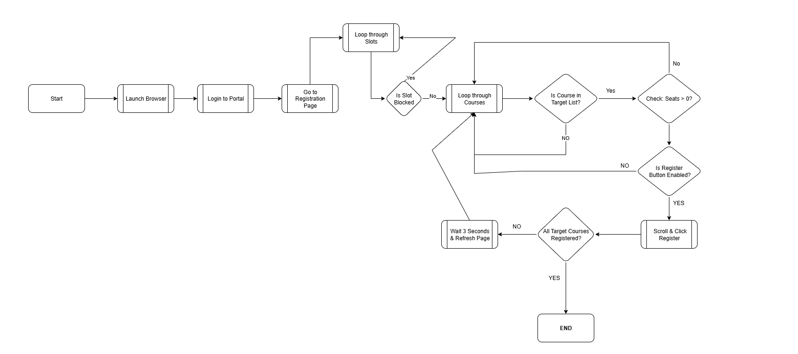
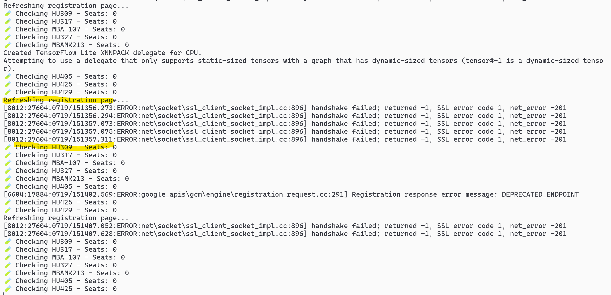

# Course Registration Automation Bot

This project automates elective course registration on the Course Registration portal using Selenium and Python.

## 📌 Features

- Logs in with your roll number and password
- Monitors elective slots x1–x10 for selected course codes
- Automatically registers when a seat becomes available
- Device spoofing and proxy setup included

## Code Access

To prevent misuse, the full automation logic is kept **private**. This public repo contains:

- Project overview
- Screenshots
- Architecture/design flow

If you're an employer or reviewer and would like access, feel free to reach out!

## Tech Stack

- Python
- Selenium WebDriver
- Tor Proxy (optional)
- Chrome automation

## Design Flow

## 🖼️ Demo

